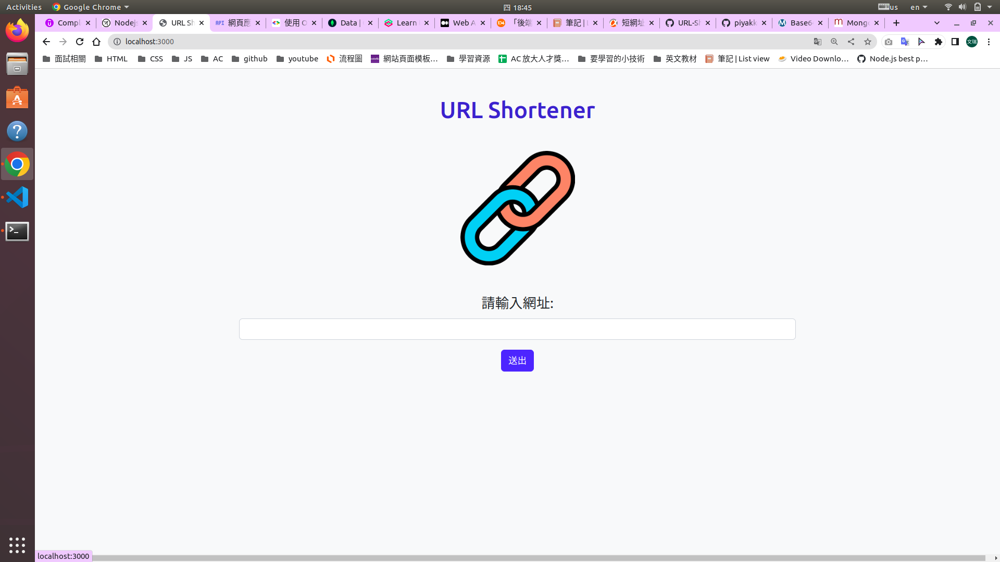
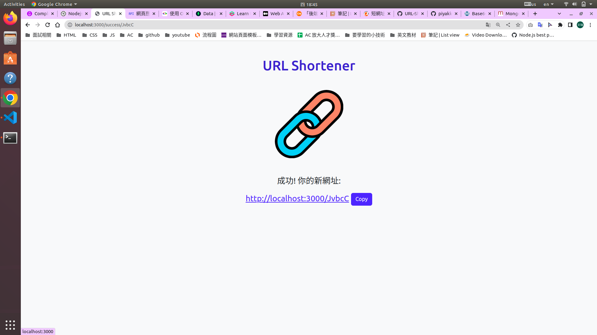
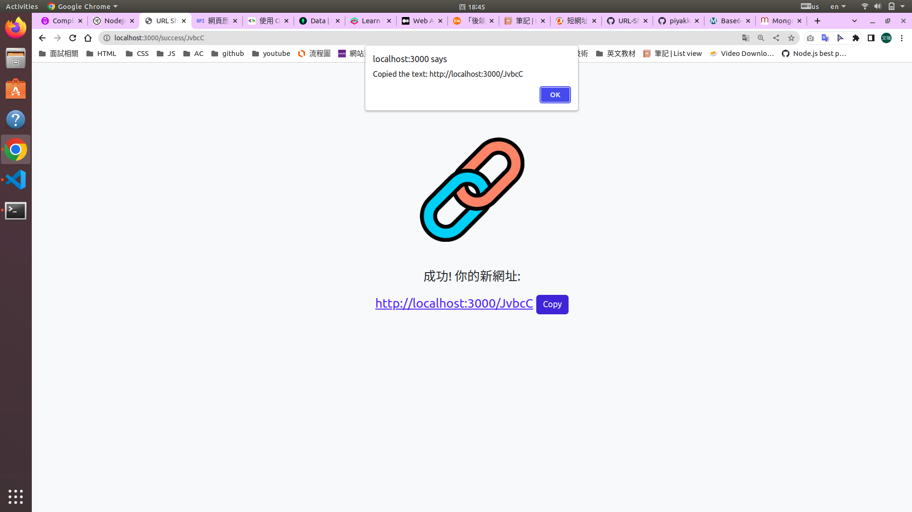
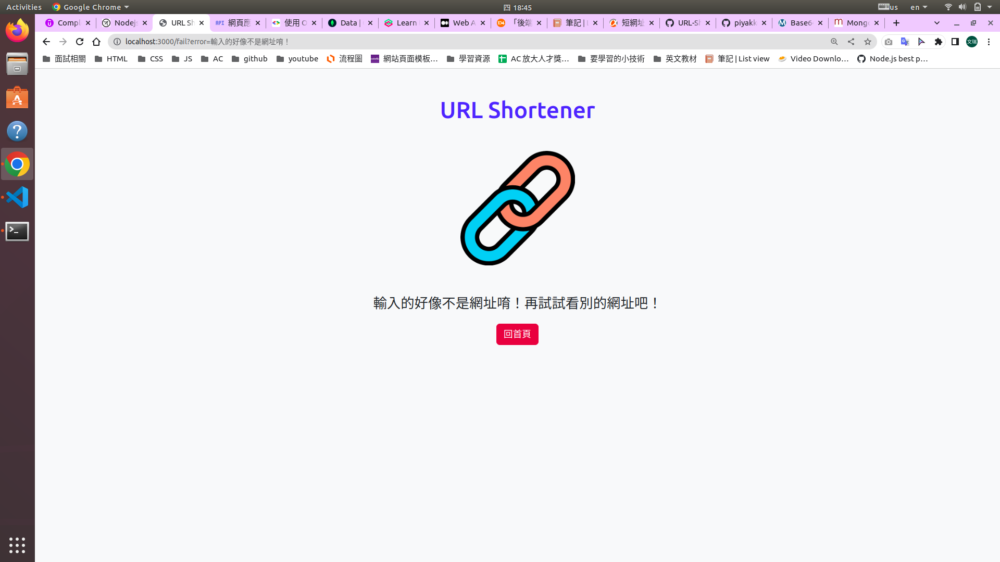

# URL-Shortener

## 畫面






## 功能
1. 縮短網址
2. 可一鍵複製縮短後之網址
3. 可透過縮短後之網址連接到原網頁

## 環境需求
+ node.js
+ Express.js
+ Express-handlebars
+ Mongoose

## 安裝與執行步驟
1. 將專案clone至本地端
```
git clone https://github.com/piyakker/url-shortener.git
```
2.切換至專案目錄
```
cd url-shortener
```
3. 安裝套件
```
npm install
```
4. 啟動專案
```
npm run dev
```